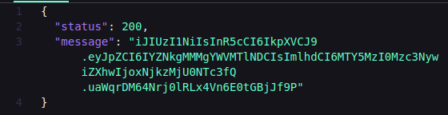
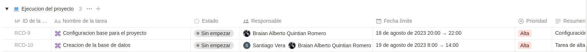

# Proyecto de Rappi 


### ¿Qué es rappi?
**Rappi en Acción: Simplificando el Acceso a lo Esencial**

 Rappi funciona como una empresa que facilita a las personas el acceso a productos y servicios fundamentales de manera más sencilla.

### Diversidad de Servicios en Rappi:

- Efectivo a Tu Alcance: En cuanto al servicio Rappicash, se concentra en llevar dinero en efectivo al lugar de elección del cliente, proporcionando facilidad en la obtención de efectivo.

- Sabores a Domicilio: La premisa de este servicio es empoderar a los usuarios para que puedan solicitar comida de diversos restaurantes en su área, ofreciendo una amplia gama de opciones culinarias. 

- Bienestar al Alcance de la Mano: En lo que respecta al servicio de Salud, Rappi facilita la adquisición de medicamentos y productos de salud esenciales para los usuarios.

- Mercado a Tu Puerta: Este servicio pone el foco en la comodidad y la eficiencia del tiempo y los recursos financieros, ya que Rappi brinda la oportunidad de realizar compras completas de alimentos y productos indispensables.

### Departamentos en rappi

#### RappiFood
 RappiFood es una aplicación móvil que facilita la entrega a domicilio de alimentos y productos esenciales. Su funcionamiento básico implica:

- Registro y Descarga: Los usuarios se registran en la aplicación Rappi y la descargan en sus dispositivos móviles.

- Exploración de Opciones: Los usuarios navegan por las categorías de restaurantes y supermercados dentro de la aplicación.

- Selección y Personalización: Eligen productos de menús de restaurantes o supermercados, y pueden personalizar los detalles de su pedido.

- Pedido y Pago: Confirman su pedido, eligen el método de pago y proporcionan la dirección de entrega.

- Asignación de Repartidor: Un repartidor (Rappitendero) recibe el pedido y se dirige al restaurante o supermercado.

- Entrega y Seguimiento: El repartidor entrega los productos en la dirección indicada, y los usuarios pueden seguir el proceso en tiempo real.

- Recepción y Calificación: Los usuarios reciben su pedido, pueden calificar la experiencia y proporcionar comentarios.

**RappiFood ofrece comodidad al combinar tecnología con entregas directas, brindando a los usuarios la posibilidad de acceder a una variedad de alimentos y productos desde cualquier lugar.**


#### RappiPay
RappiPay es un servicio de pagos y transferencias dentro de la aplicación Rappi. Aquí te presento un resumen de cómo funciona:

- Habilitación de RappiPay: Los usuarios activan RappiPay en su cuenta Rappi, proporcionando información financiera y estableciendo medidas de seguridad.

- Pagos en Establecimientos: Los usuarios pueden pagar en tiendas asociadas escaneando un código QR o ingresando un número de identificación.

- RappiPay Wallet: La función "RappiPay Wallet" permite a los usuarios almacenar fondos en su billetera virtual dentro de la aplicación.

- Transferencias a Otros Usuarios: Los usuarios pueden transferir dinero a amigos u otros usuarios de Rappi directamente desde su billetera virtual.

- Seguridad y Protección: RappiPay utiliza medidas de seguridad avanzadas para proteger la información financiera y las transacciones de los usuarios.

- Historial de Transacciones: Los usuarios pueden rastrear sus transacciones y ver el historial de pagos y transferencias en la aplicación.

- Facilidad y Conveniencia: RappiPay brinda una forma fácil y rápida de realizar pagos y transferencias sin necesidad de efectivo ni tarjetas físicas.

RappiPay agiliza los pagos y las transferencias al integrar estas funciones en la misma plataforma de Rappi, ofreciendo a los usuarios una solución de pago conveniente y segura en su vida cotidiana.


#### RappiTravel
RappiTravel es la función dentro de la aplicación Rappi que te permite planificar y reservar vuelos y alojamiento. A continuación, un resumen de cómo funciona:

- Acceso a RappiTravel: Los usuarios pueden acceder a la función RappiTravel desde la aplicación principal de Rappi.

- Búsqueda de Vuelos y Alojamiento: Los usuarios ingresan sus destinos y fechas de viaje para buscar opciones de vuelos y alojamiento.

- Comparación de Opciones: RappiTravel presenta diferentes opciones de vuelos y hoteles, junto con detalles como precios y horarios.

- Reserva y Pago: Una vez que los usuarios eligen su vuelo y alojamiento preferidos, pueden confirmar la reserva y realizar el pago.

- Itinerario y Detalles: RappiTravel proporciona un itinerario completo con los detalles de vuelo y alojamiento, incluyendo códigos de reserva y horarios.

- Asistencia y Soporte: Los usuarios pueden acceder a soporte en caso de cambios en el itinerario o cualquier problema relacionado con el viaje.

- Centralización en la App: RappiTravel ofrece una experiencia de reserva de viajes completa, todo desde la misma aplicación de Rappi.

RappiTravel simplifica la planificación y reserva de viajes al centralizar estas funciones en la plataforma Rappi, brindando a los usuarios la comodidad de organizar sus viajes directamente desde su dispositivo móvil.


### ¿Cómo funciona rappi?
Rappi es una aplicación móvil que ofrece una variedad de servicios a los usuarios, incluyendo entregas de alimentos, compras de supermercado, pagos y transferencias, y reservas de viajes. La aplicación se puede descargar en dispositivos iOS y Android, y los usuarios deben registrarse para acceder a los servicios.


**Exploración de Servicios**: Accediendo a un catálogo de restaurantes o servicios, los usuarios encuentran útil una función de búsqueda para una navegación más efectiva. En muchas ocasiones, buscan establecimientos por nombre, ubicación o menú.

**Pedidos Realizados**: Agregar elementos al carrito debe ser intuitivo, permitiendo modificaciones o eliminaciones con facilidad. Luego, se revisa y confirma el resumen del pedido antes de proceder al pago.

**Notificaciones**: Mantener a los clientes informados sobre el estado de sus pedidos (Confirmado, En Progreso, En Camino, Entregado) es esencial debido a sus agendas ocupadas. Notificaciones push o mensajes de texto son canales efectivos para este propósito, garantizando la relevancia de la información compartida.

**Historial de Pedidos**: Mejorando la experiencia del usuario, se brinda acceso a un historial de pedidos anteriores. Esto facilita la repetición de pedidos y el acceso a los platos favoritos, promoviendo la lealtad del cliente.

**Gestión y Creación de Cuentas**: Para comenzar a utilizar la aplicación, los usuarios se registran, optando por un proceso rápido y simple que recopila solo los datos esenciales. Las opciones de registro incluyen correo electrónico, número telefónico y contraseña, así como la alternativa de utilizar Google o Facebook.

**Procesamiento de Pagos**: Al inicio, se ofrecen de 2 a 3 métodos de pago, con la opción de expandir esta selección con el crecimiento de la plataforma. Los usuarios que han ingresado previamente sus detalles de pago pueden optar por esta opción durante el proceso de compra.

**Opiniones y Valoraciones**: Los usuarios evalúan los servicios, tiempos de espera y calidad de los alimentos a través de calificaciones y reseñas. Fomentar su participación en esta área es valioso para identificar problemas potenciales en el servicio.

**Seguimiento de Pedidos**: A través de la función de seguimiento, los usuarios rastrean sus pedidos en tiempo real, basándose en APIs de ubicación como las ofrecidas por Google en Android o la CoreLocation Framework en iOS. Estas herramientas también estiman el tiempo de entrega en función de la ubicación del repartidor.


## Bibliografia

- [Rappi](https://www.rappi.com.co/)
- [¿Qué es?](https://blog.rappi.com/que-es-rappi/)
- [¿Cómo funciona?](https://www.lacoladerata.co/opinion/analisis/como-funcionan-las-companias-de-domicilio-como-rappi/)
- [Éxito de rappi](https://www.escuelasuperiordenegocios.mx/post/rappi-y-la-fórmula-de-su-éxito)
- [¿Cómo se inicia con rappi?](https://merchants.rappi.com/es-co/recursos/empieza-con-rappi)
- [Historia de rappi](https://about.rappi.com/es/nuestra-historia)
- [Trabajar en rappi](https://coworkings.co/como-hacer-para-trabajar-en-rappi/)
- [Departamentos](https://merchants.rappi.com/es-co/recursos)
- [Recursos](https://merchants.rappi.com/es-co/que-ofrecemos)
- [Cómo funcionan estas compañías](https://blog.wearedrew.co/caso-de-estudio/caso-rappi-revolucion-en-el-delivery)
- [RappiPay](https://rappipay.co/acerca-de-rappipay/)
- [RappiTravel](https://travel.rappi.com.co/)
- [RappiFavor](https://blog.rappi.com/que-es-rappifavor/)


# Rappi Campus
Rappi Campus es un proyecto que permitira brindar un servicio de entrega de productos a domicilio a las personas, utilizando tecnologias de desarrollo web.


## Qué tecnologias se implementarán:
- [React](https://es.react.dev/)
- [MongoDB](mongodb.com/docs/)
- [Express](https://expressjs.com/es/resources/glossary.html)
- [NodeJS](https://nodejs.org/en/docs)
- [Typescript](https://www.typescriptlang.org/docs/)

- Se implementarán más tecnologias que se irán añadiendo conforme el proyecto avanza

## Que tendrá el proyecto

- Servicio de entrega a domicilio
- Servicio de pago en linea
- Servicio de rastreo de pedidos
- Servicio de notificaciones
- Servicio de valoraciones y opiniones
- Servicio de historial de pedidos
- Modulo de clientes
- Modulo de repartidores
- Modulo de restaurantes
- Modulo de supermercados

## Que se espera del proyecto
- Que sea un proyecto que pueda ser escalable
- Que sea un proyecto que pueda ser implementado en diferentes paises
- Que sea un proyecto que pueda ser implementado en diferentes idiomas
- Que sea un proyecto que pueda ser implementado en diferentes navegadores

## Complementos

**Cabe destacar que el proyecto está en constante desarrollo, por lo que se irán añadiendo más complementos a medida que el proyecto avance.**


## Como está compuesta la base de datos del proyecto


**Módulo clientes: - Santiago**

- **cli_dni**
- **cli_primerNombre**
- **cli_segundoNombre**
- **cli_primerApellido**
- **cli_segundoApellido**
- **cli_telefono**
- **cli_email**
- **cli_fecha_nac**
- **cli_genero**

**Módulo repartidores - Braian**

- **rep_dni**
- **rep_primerNombre**
- **rep_segundoNombre**
- **rep_primerApellido**
- **rep_segundoApellido**
- **rep_telefono**
- **rep_email**
- **rep_fecha_nac**
- **rep_genero**
- **rep_codigo_vehiculo**

**Módulo vehículos - Braian**

- **veh_codigo**
- **veh_marca**
- **veh_modelo**
- **veh_placa**
- **veh_color**
- **veh_tipo**

**Módulo restaurante - Santiago**

- **res_nit**
- **res_nombre**
- **res_direccion**
- **res_telefono**
- **res_categoria**

**Módulo producto - Braian**

- **pro_id**
- **pro_nombre**
- **pro_precio**
- **pro_descripcion**
- **pro_categoria**
- **pro_restaurante**
- **pro_imagen**

**Módulo empleados - Santiago**

- **emp_dni**
- **emp_primerNombre**
- **emp_segundoNombre**
- **emp_primerApellido**
- **emp_segundoApellido**
- **emp_telefono**
- **emp_email**
- **emp_fecha_nac**
- **emp_genero**
- **emp_tipo**

**Módulo Pedidos - Braian y Santiago**

- **ped_id**
- **ped_cliente**
- **ped_restaurante**
- **ped_estado**
- **ped_fecha**
- **ped_hora**
- **ped_direccion**
- **ped_repartidor**
- **ped_pago**

**Módulo Detalles Pedido - Braian**

- **det_ped_id**
- **det_ped_pedido**
- **det_ped_producto**
- **det_ped_cantidad**

# Instalacion

1. Clona este repositorio en tu máquina local.
2. Asegúrate de tener instalado Node.js
3. Crea un archivo .env
4. Copia las variables de entorno del archivo `.env.example` y pegalas en el archivo `.env` que creaste.

  `Nota`: porfavor llena los campos vacios con la informacion correspondiente.

  `Recuerda que la informacion solitada la debes ingresar entre las "" correspondientes`

  

5. Abre una terminal

    

    presiona en neva terminal:

    

6. Ejecuta el comando `npm run install` para instalar las dependencias del proyecto

  una vez que haya finalizado la instalacion de las dependencias ejecuta el comando `npm run install-dev` para instalar la dependencia de desarrollo.

  

7. Ejecuta el comando `npm run dev` para iniciar el servidor

  

1. ¡Felicitaciones!, ya has iniciado el servidor y la base de datos y puedes proceder a  utilizar los endpoints

2. `NOTA`: Para utilizar los endpoints recuerda que debes tener un token que se genera con el endpoint `/login` (en la siguienta parte se te muestra como puedes pedir el token y utilizarlo)

# Creacion de la base de datos
 
 Entra en el archivo query.mongodb en la carpeta db deberías tener esto:

 

 presiona en el icono de play que se encuentra en la parte superior derecha, para crear toda la base de datos así:

  

  deberías obtener una respuesta como está:

  
  
### Observacion: Para hacer los endpoints y generar los token debes tener ThunderClient instalado en visual studio code

- **Autorización**

  `NOTA`: Antes de utilizar cualquier endpoint debes pedir primero un token de autorizacion.

  *Obeservacion* el token solamente dura `3h`  después de este tiempo tendrás que pedir otro

  Este es el ejemplo para solicitar un token:
  
  `Observacion` Debes colocar la version del api de pediendo de que tipo de usuario es:

  - Si es un `cliente` debe colocarse la version: `1.0.0` 
  - Si es un `repartidor` debe colocarse la version: `2.0.0`
  - Si es un `empleado` debe colocarse la version: `3.0.0`

  Ejemplo para colocar la version para los clientes:

  

  Si no especificas el api version te dara un error `422` ya que está diseñado para que trabaje con distintos login para cada tipo de usuario

  
  
  Para generar un token es mediante el email y la contraseña del usuario enviadola por el body con un method `POST`

  `Observacion`: El email y la contraseña se envia como este ejemplo:

    ```json
        {
            "email": "ejemplo@example.com",
            "password": "ejemplo123"
        }
    ```

    `Observacion`:  El email y la contraseña se envian como string

    

    si el usuario no está previamente registrado, mostrará un error `403` y deberás registrarlo en la base de datos para poder generar el token. **(Más adelante se muestra como registrar un usuario)**; Aquí se muestra el error

    

    Si el usuario está registrado, se generará un token de autorización que deberás utilizar para acceder a los endpoints protegidos.

  `NOTA`: Este token solamente funcionará para las collection que tenga acceso dicho usuario.

  
  
  `NOTA`: No olvides reemplazar el `localhost` por la ip de tu servidor y el `5050` por el puerto que hayas definido en las variables de entorno, u/o que se estes utilizando.

```shell
  http://localhost:5050/login
```

- Implementación del Token

    

- Tendrás un token parecido a esto así, ejemplo:
    - `iJIUzI1NiIsInR5cCI6IkpXVCJ9.eyJpZCI6IYZNkgMMMgYWVMTlNDCIsImlhdCI6MTY5MzI0Mzc3NywiZXhwIjoxNjkzMjU0NTc3fQ.uaWqrDM64Nrj0lRLx4Vn6E0tGBjJf9P`

- Luego debe colocar en la pestaña Headers de la siguiente manera:
  
- donde dice `header` escribe `Authorization` y pulsa en el recuadro para que se active el envió del token de autorización, así:

    

- Coloca la palabra `Bearer` y un espacio, luego pega el token que habias copiado previamente, :

    

- Una vez que hayas implementado el token puedes proceder a utilizar los endpoints.

**TENER EN CUENTA:**

  `NOTA`: recuerda que el token solamente dura `3h`  después de este tiempo tendrás que pedir otro

  `NOTA`: El token solo servira para la collection que tienes acceso

  `NOTA`: Si presentas algun error al momento de solicitar el token, revisa que hayas ingresado correctamente los datos, si el error persiste, revisa que estes escribriendo correctamente la palabra `Bearer`


- **LIMITES DE PETICION DE ENPOINTS**
  
  `NOTA`: Los endpoints tienen un limite de peticiones, si se excede el limite de peticiones por minuto, el servidor respondera con un error 429, si esto sucede, espera y vuelve a intentarlo.
  **Cabe mencionar que el limit para cada endpoint es distinto por lo tanto no se proporciona informacion de cuanto tiempo tendrás que esperar para volver a intentarlo**

  `Observacion`: Para el enpoint de `/login` tienes 3 intentos, después de eso tendrás que esperar una hora para volver a intentarlo.

# Endpoints
## Clientes

`Observacion`: Este endpoint no permite borrar clientes, solamente se puede cambiar de estado Activo a Inactivo

### Obtener la informacion de los clientes

>Solo los administradores tienen acceso

**Detalles de la API**

  - Metodo: `GET`
  - URL: `http://localhost:5050/clientes`
  - Version: `1.0.0`

**Capturas de Pantalla**

  

Está solicitud se utiliza para obtener la informacion sobre todos los clientes registrados en la base de datos

### Obtener la informacion de un cliente en especifico

> Los empleados y los administradores tienen acceso

**Detalles de la API**

  - Metodo: `GET`
  - URL: `http://localhost:5050/clientes/:dni`
  - Version: `1.0.1`

**Capturas de Pantalla**

  

Está solicitud se utiliza para obtener la informacion sobre un cliente en especifico, para ello se debe enviar el DNI del repartidor por la url

### Registro de Clientes

> Solo  los clientes y los administradores tienen acceso

**Detalles de la API**

- Método: `POST`
- URL: `http://localhost:5050/clientes`
- Versión: `1.0.2`

**Ejemplo de Datos JSON:**

```json
{
  "dni-cliente": "123456789",
  "nombre-cliente": "Nombre",
  "apellido-cliente": "Apellido",
  "telefono-cliente": "1234567890",
  "correo-cliente": "correo@example.com",
  "contraseña-cliente": "contraseña123",
  "cumpleaños-cliente": "1990-01-01",
  "genero-cliente": "Masculino"
}
```

***Asegúrate de reemplazar los valores en el ejemplo con los datos reales del usuario que deseas crear.***

**Capturas de Pantalla**

  

**Notas**
- Todos los campos son obligatorios a menos que se indique lo contrario.
- El campo "dni-cliente" debe ser único para cada cliente, por el momento se puede repetir el dni, en la proxima version del api se corregirá eso.
- Asegúrate de proporcionar el formato correcto para el campo "cumpleaños-cliente" (AAAA-MM-DD).


### Actualizar los datos del cliente:

> Solo los clientes y los administradores tienen acceso

**Detalles de la API**

- Método: `PUT`
- URL: `http://localhost:5050/clientes/:dni`
- Versión: `1.0.3`

**Ejemplo de Datos JSON:**

```JSON
{
  "telefono-cliente": "324156216",
  "estado-cliente": "Inactivo"
}
```

***Asegúrate de reemplazar los valores en el ejemplo con los datos reales del usuario que deseas actualizar.***

**Capturas de Pantalla**

  

**Notas**
- Solo se pueden actualizar los campos que se indica
- En una siguiente version del api se podrán actualizar más datos.

## Repartidores

`Observacion`: Este endpoint no permite borrar clientes, solamente se puede cambiar de estado Activo a Inactivo

### Obtener la informacion de los repartidores

> Solo los administradores tienen acceso

**Detalles de la API**

  - Metodo: `GET`
  - URL: `http://localhost:5050/repartidores`
  - Version: `1.0.0`

**Capturas de Pantalla**

  

Está solicitud se utiliza para obtener la informacion sobre todos los repartidores registrados en la base de datos

### Obtener informacion de un repartidor en especifico

> Los empleados y los administradores tienen acceso

**Detalles de la API**

  - Metodo: `GET`
  - URL: `http://localhost:5050/repartidores/:dni`
  - Version: `1.0.1`

**Capturas de Pantalla**

  

Está solicitud se utiliza para obtener la informacion sobre un repartidor en especifico, para ello se debe enviar el DNI del repartidor por la url

### Registro de repartidor

> Los repartidores y los administradores tienen acceso

**Detalles de la API**

  - Metodo: `POST`
  - URL: `http://localhost:5050/repartidores`
  - Version: `1.0.2`

**Ejemplo de Datos JSON:**

```JSON
{
  "dni-repartidor": 1234567890,
  "nombre-repartidor": "Juan Pérez",
  "apellido-repartidor": "González",
  "telefono-repartidor": "555-123-4567",
  "correo-repartidor": "juan.perez@example.com",
  "contraseña-repartidor": "secretpass123",
  "cumpleaños-repartidor": "1995-08-15",
  "genero-repartidor": "Masculino",
  "vehiculo-marca": "Honda",
  "vehiculo-modelo": "CBR500R",
  "vehiculo-placa": "ABC123",
  "vehiculo-color": "Rojo",
  "tipo-vehiculo": "Motos"
}
```

***Asegúrate de reemplazar los valores en el ejemplo con los datos reales del usuario que deseas crear.***

**Capturas de Pantalla**

  

Está solicitud se utiliza para registrar un repartidor en la base de datos, para ello se debe enviar la informacion del repartidor por el body

### Actualizar la informacion de un repartidor

> Los repartidores y los administradores tienen acceso

  - Metodo: `PUT`
  - URL: `http://localhost:5050/repartidores/:dni`
  - Version: `1.0.3`

  

Está solicitud se utiliza para actualizar la informacion de un repartidor en especifico, para ello se debe enviar la informacion del repartidor por el body

## Restaurantes

`Observacion`: Este endpoint no permite borrar restaurantes

### Obtener la informacion de todos los restaurantes

> Solo los administradores tienen acceso

**Detalles del api**

  - Metodo: `GET`
  - URL: `http://localhost:5050/restaurantes`
  - Version: `1.0.0`

**Capturas de Pantalla**
  
  

Está solicitud se utiliza para obtener la informacion sobre todos los restaurantes registrados en la base de datos

### Obtener la informacion de un restaurante en especifico

> Los empleados y los administradores tienen acceso

**Detalles del api**

  - Metodo: `GET`
  - URL: `http://localhost:5050/restaurantes/:nombre`
  - Version: `1.0.1`

**Capturas de Pantalla**

  

Está solicitud se utiliza para obtener la informacion sobre un restaurante en especifico, para ello se debe enviar el nombre del restaurante por la url

### Registro de restaurantes

>   Los restaurantes y los administradores tienen acceso

**Detalles del api**

  - Metodo: `POST`
  - URL: `http://localhost:5050/restaurantes`
  - Version: `1.0.2`

**Ejemplo de Datos JSON:**
  
  ```JSON
  {
    "nit-restaurante": 1234567890,
    "nombre-restaurante": "Restaurante",
    "direccion-restaurante": "Calle 123",
    "correo-restaurante": "arepa@gmail.com",
    "contraseña-restaurante":"1253461",
    "telefono-restaurante": "31625",
    "categoria-restaurante": "Comida Rapida",
    "hora-apertura":"10:00",
    "hora-cierre": "20:00"
  }
  ```

***Asegúrate de reemplazar los valores en el ejemplo con los datos reales del usuario que deseas crear.***

**Capturas de Pantalla**

  

Está solicitud se utiliza para registrar un restaurante en la base de datos, para ello se debe enviar la informacion del restaurante por el body


### Actualizar la informacion de un restaurante

> Los restaurantes y los administradores tienen acceso

**Detalles del api**

  - Metodo: `PUT`
  - URL: `http://localhost:5050/restaurantes/:nit`
  - Version: `1.0.3`

**Ejemplo de Datos JSON:**
  
```JSON
  {
    "telefono-restaurante": "31625",
    "hora-apertura":"07:00",
    "hora-cierre": "20:00"
  }
```
***Asegúrate de reemplazar los valores en el ejemplo con los datos reales del usuario que deseas actualizar.***

**Capturas de Pantalla**

  

Está solicitud se utiliza para actualizar la informacion de un restaurante en especifico, para ello se debe enviar la informacion del restaurante por el body


## Empleados

`Observacion`: Este endpoint no permite borrar empleados

### Obtener la informacion de todos los empleados

> Solo los administradores tienen acceso

**Detalles del api**

  - Metodo: `GET`
  - URL: `http://localhost:5050/empleados`
  - Version: `1.0.0`

**Capturas de Pantalla**

  

Está solicitud se utiliza para obtener la informacion sobre todos los empleados registrados en la base de datos

### Obtener la informacion de un empleado en especifico

> Los restaurantes y los administradores tienen acceso

**Detalles del api**

  - Metodo: `GET`
  - URL: `http://localhost:5050/empleados/:dni`
  - Version: `1.0.1`

**Capturas de Pantalla**

  

Está solicitud se utiliza para obtener la informacion sobre un empleado en especifico, para ello se debe enviar el DNI del empleado por la url

### Registro de empleados

> Los empleados y los administradores tienen acceso

**Detalles del api**

  - Metodo: `POST`
  - URL: `http://localhost:5050/empleados`
  - Version: `1.0.2`

**Ejemplo de Datos JSON:**

```JSON
{
  "dni-empleado": 123456,
  "nombre-empleado": "Pepito",
  "apellido-empleado": "Perez",
  "telefono-empleado": "3131286121",
  "correo-empleado": "pepe1@gmail.com",
  "contraseña-empleado": "123",
  "cumpleaños-empleado": "1999-07-07",
  "genero-empleado": "Masculino",
  "nombre-restaurante": "Dominos",
  "tipo-empleado":"Gerente"
}
```

***Asegúrate de reemplazar los valores en el ejemplo con los datos reales del usuario que deseas crear.***

**Capturas de Pantalla**

  

Está solicitud se utiliza para registrar un empleado en la base de datos, para ello se debe enviar la informacion del empleado por el body

### Actualizar la informacion de un empleado

> Los empleados y los administradores tienen acceso

**Detalles del api**

  - Metodo: `PUT`
  - URL: `http://localhost:5050/empleados/:dni`
  - Version: `1.0.3`

**Ejemplo de Datos JSON:**

```JSON
{
  "telefono-empleado": "3131286121",
  "estado-empleado": "Inactivo",
  "tipo-empleado":"Gerente"
}
```

***Asegúrate de reemplazar los valores en el ejemplo con los datos reales del usuario que deseas actualizar.***

**Capturas de Pantalla**

  

Está solicitud se utiliza para actualizar la informacion de un empleado en especifico, para ello se debe enviar la informacion del empleado por el body

------


## Cómo asignar ramas en GitHub:

### Paso 1: Crear una nueva rama
```bash
# Desde la línea de comandos
git checkout -b nombre-de-la-rama
```

### Paso 2: Realizar cambios y confirmar
Realiza tus cambios en la nueva rama y luego confírmalos.
```bash
git add .
git commit -m "Descripción de los cambios"
```

### Paso 3: Subir la rama al repositorio remoto
```bash
git push origin nombre-de-la-rama
```

### Paso 4: Crear una Pull Request (PR)
Dirígete a tu repositorio en GitHub y verás un mensaje para comparar y crear una Pull Request desde tu rama. Completa los detalles y crea la PR.

### Paso 5: Revisión y fusión
Espera a que otros revisen tus cambios en la PR. Si todo está bien, alguien con los permisos adecuados puede fusionar la PR en la rama principal.

## Cómo realizar un release en GitHub:

### Paso 1: Preparar la versión
Asegúrate de que todos los cambios relevantes estén en la rama principal y lista para el release.

### Paso 2: Crear un tag (etiqueta) para la versión
```bash
# Crear un tag y asociarlo al commit actual
git tag -a v1.0.0 -m "Versión 1.0.0"
```

### Paso 3: Subir el tag al repositorio remoto
```bash
git push origin v1.0.0
```

### Paso 4: Crear el release en GitHub
1. Ve al repositorio en GitHub.
2. Navega a la pestaña "Releases" y haz clic en "Create a new release".
3. Ingresa el nombre del tag (ej. v1.0.0) en "Tag version".
4. Completa el título del release.
5. Puedes añadir notas adicionales y enlaces.
6. Haz clic en "Publish release" para crear el release.

### Código en consola para asignar ramas y realizar un release:
```bash
# Crear y cambiar a una nueva rama
git checkout -b nombre-de-la-rama
```

```bash
# Realizar cambios y confirmar en la nueva rama
git add .
git commit -m "Descripción de los cambios"
```
```bash
# Subir la rama al repositorio remoto
git push origin nombre-de-la-rama
```

```bash
# Crear un tag y subirlo al repositorio remoto
git tag -a v1.0.0 -m "Versión 1.0.0"
git push origin v1.0.0
```

Recuerda reemplazar `nombre-de-la-rama` y `v1.0.0` con los nombres y versiones adecuados según tu proyecto.

# Notion: Plataforma de Gestión de Tareas y Colaboración


**Notion** es una plataforma que combina la gestión de tareas, la toma de notas y la colaboración en un solo lugar. Permite a los usuarios crear y organizar información de manera flexible, lo que la hace ideal para equipos y proyectos. Aquí hay una descripción general de cómo funcionaba Notion:

1. Espacio de Trabajo Estructurado
Notion se basa en el concepto de páginas y bloques. Las páginas pueden ser carpetas, documentos o bases de datos, y los bloques son elementos individuales de contenido dentro de esas páginas. Los bloques pueden ser texto, listas, imágenes, enlaces, tablas, archivos adjuntos, etc.

2. Organización Personalizada
Los usuarios pueden crear su propio sistema de organización mediante la creación y la jerarquía de páginas y subpáginas. Esto permite adaptar Notion a las necesidades específicas de cada usuario o proyecto.

3. Gestión de Tareas y Proyectos
Notion permite crear listas de tareas, tablas Kanban, calendarios y más para la gestión de proyectos y tareas. Puedes asignar tareas a miembros del equipo, establecer fechas límite y prioridades.

4. Colaboración en Tiempo Real
Varios usuarios pueden colaborar en un espacio de trabajo de Notion al mismo tiempo. Los cambios se reflejan en tiempo real, lo que facilita la colaboración en equipo sin problemas.

5. Bases de Datos y Consultas
Notion permite crear bases de datos personalizadas con campos y propiedades específicas. Puedes agregar filtros, ordenar y agrupar datos en estas bases de datos para un análisis más profundo.

6. Plantillas y Personalización
Notion proporciona una amplia variedad de plantillas predefinidas para diferentes casos de uso, como gestión de proyectos, seguimiento de objetivos, planificación de viajes y más. También puedes personalizar estas plantillas según tus necesidades.

7. Integraciones y Automatizaciones
Notion ofrece integraciones con otras herramientas populares, como Google Drive, Slack, Trello y más. También tiene funciones de automatización que permiten crear flujos de trabajo automatizados.

8. Aplicaciones Móviles y Acceso en Línea
Notion está disponible en dispositivos móviles (iOS y Android) y se puede acceder a través de navegadores web, lo que permite acceder a tus datos desde cualquier lugar.

Ejemplo:



Bibliografía:
- [Notion](https://www.notion.so/)
- [¿Qué es Notion y cómo funciona? Guía completa - Crehana](https://www.crehana.com/blog/negocios/que-es-notion/)
- [Cómo Usar Notion: Guía Completa Para Principiantes - Juan Pardo](https://juanpardo.es/como-usar-notion/)
- [Notion, qué es y cómo funciona - El Grupo Informático](https://www.elgrupoinformatico.com/tutoriales/notion-que-como-funciona-t77621.html)

## Autores
- [Braian Alberto Quintian Romero](https://github.com/Braian-Quintian)
- [Daniel Santiago Vera Anaya](https://github.com/dVera17)
